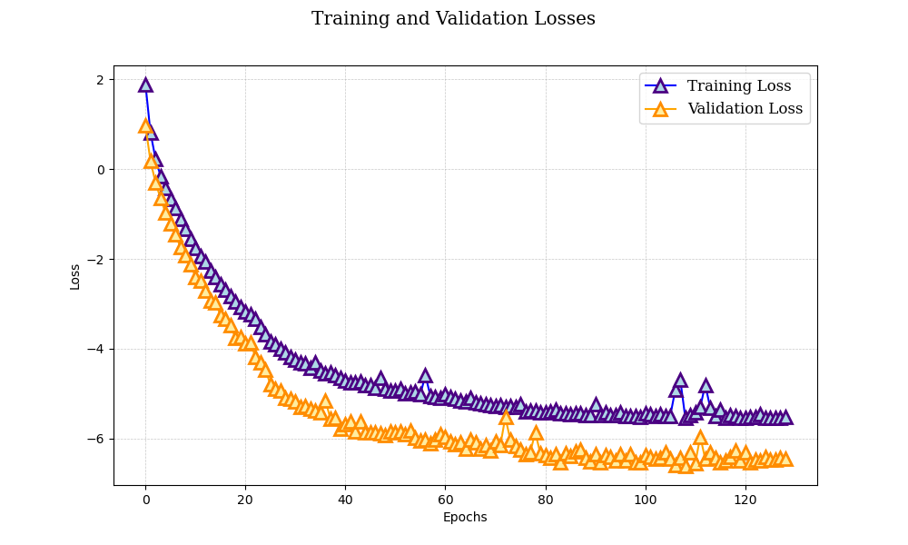
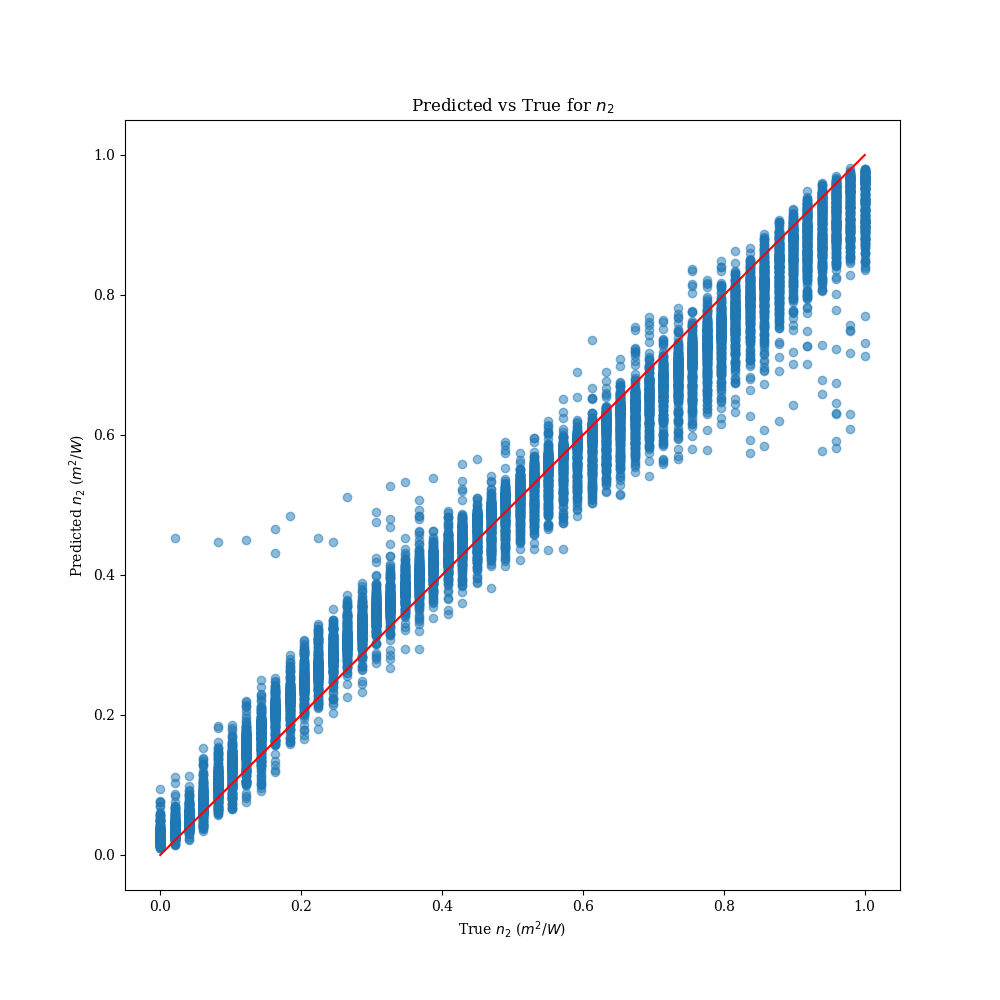
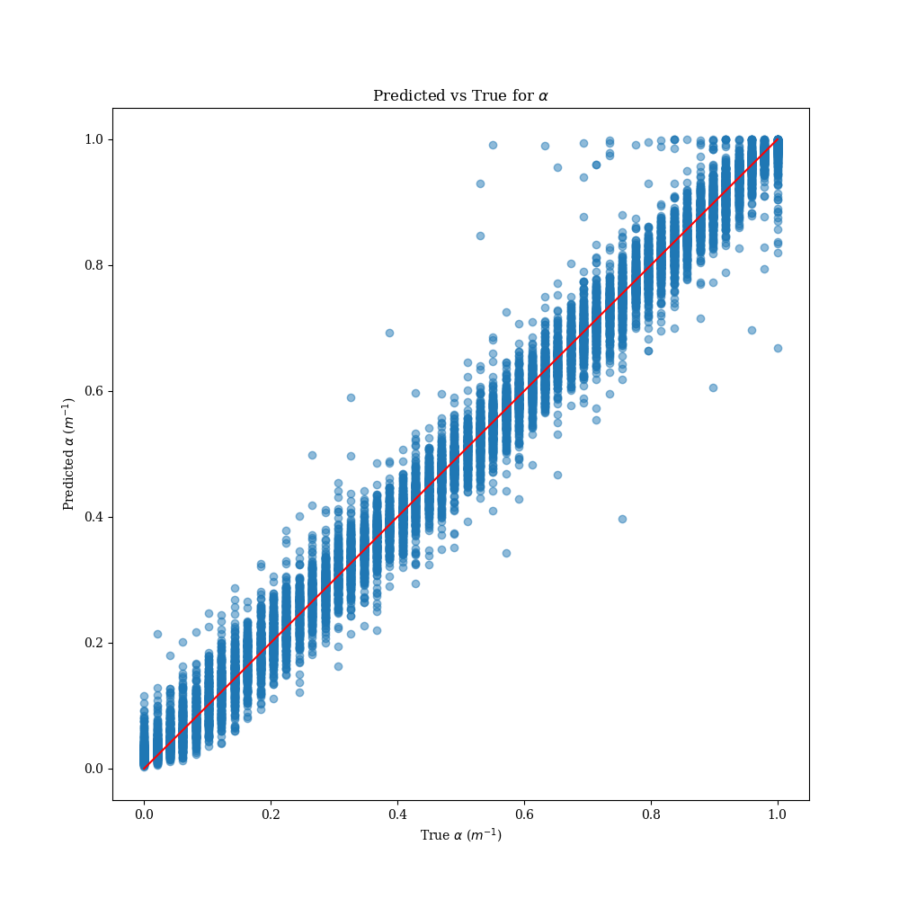
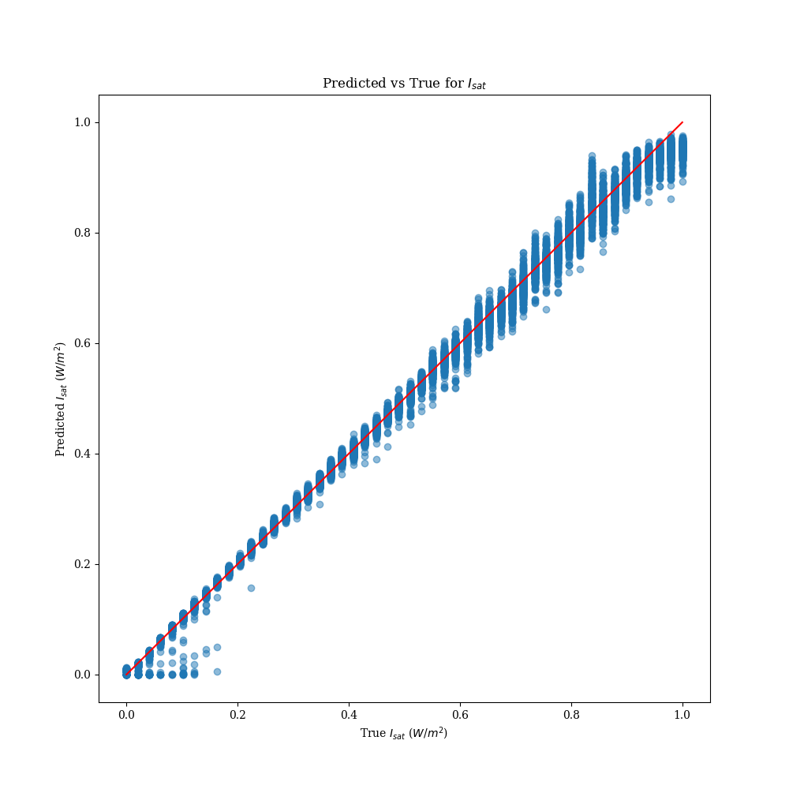
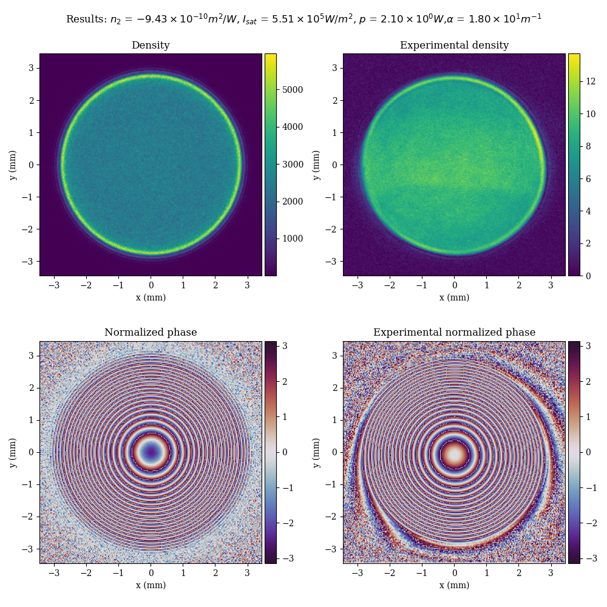
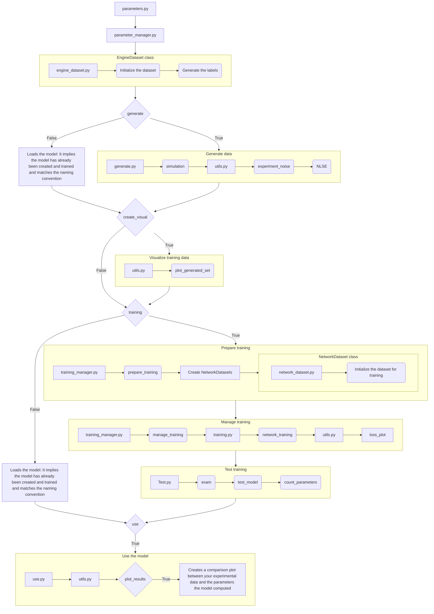

# XP2NLSE-ML: Experiment to Nonlinear Schrödinger Equation Parameter Estimation with machine learning

# Problem

## Physical situation

[NLSE](https://github.com/Quantum-Optics-LKB/NLSE) offers a powerful simulation tool to solve a typical [non linear Schrödinger](https://en.wikipedia.org/wiki/Nonlinear_Schr%C3%B6dinger_equation) / [Gross-Pitaevskii](https://en.wikipedia.org/wiki/Gross%E2%80%93Pitaevskii_equation) equation of the type :
$$i\partial_{t}\psi = -\frac{1}{2}\nabla^2\psi+g|\psi|^2\psi$$

In this particular instance, it can solve in the formalism of the propagation of a pulse of light in a non linear medium (here a Rubidium cell).
Within the [paraxial approximation](https://en.wikipedia.org/wiki/Paraxial_approximation), the propagation equation for the field $E$ in $V/m$ solved is:

$$
i\partial_{z}E = -\frac{1}{2k_0}\nabla_{\perp}^2 E - n_2 \frac{k_0c\epsilon_0}{2}|E|^2E - i \frac{\alpha}{2}
$$

The system holds 3 unknowns: the non-linear index $n_2$, the absorption $\alpha$ and the saturation intensity $I_{sat}$.
Aside from $\alpha$, these parameters are coupled and cannot be measured in the experiment. They are intrinsic properties of the system.

With the recent research in machine learning and optimization tools thriving, the idea was to attempt and solve this problem with neural networks. 

# Solution

## Overview

This repository uses the machine learning model dedicated to the estimation of parameters within the Nonlinear Schrödinger Equation (NLSE) representing the propagation of a laser beam inside a hot Rubidium vapor cell.

### Source

The code for the back bone of this model is [Convnext_tiny](https://pytorch.org/vision/main/models/generated/torchvision.models.convnext_tiny.html). This adaptation is inspired by the paper ["A ConvNet for the 2020s" by Zhuang Liu, et al., 2022](https://arxiv.org/abs/2201.03545). 

## Workflow

1. **Create Your Setup**: Design your experimental setup.
2. **Record Output parameters**: Take note of all the parameters of your system to ensure the data you will generate will be able to represent your system.
3. **Explore the parameter space**: There is a sandbox program that allows you to tryout your generation parameters to check that your simulations converge and looks a bit like your experiment. This will help the process of generating your training data.
4. **Generate Training Data**: The data is generated using [NLSE](https://github.com/Quantum-Optics-LKB/NLSE) based on your parameters.
5. **Train the Model**: Train the model using the generated data.
6. **Estimate your parameters**: Apply the trained model to experimental data to estimate parameters.


# Getting Started

## Prerequisites

Ensure you have Python 3.x installed. This project requires the following external libraries:

- **NumPy**
- **Matplotlib**
- **SciPy**
- **CuPy**
- **NLSE**
- **PyTorch**
- **Skimage**
- **Sklearn**
- **tqdm**
- **Kornia**
- **Torchvision**

These dependencies can be installed using mamba.

The requirements are in the requirements.txt at the root of the repo.

### Installation

Clone the repository and navigate into the project directory:

```bash
git clone https://github.com/Quantum-Optics-LKB/xp2nlse-ml.git
cd xp2nlse-ml
```

# Usage

When starting I suggest you start with:

The [`sandbox_parameters.py`](/sandbox_parameters.py) script is where you can try parameters for the data generation and see how the generated data would look like from your parameters. Then you can just take these parameters and put them into the [`parameters.py`](/parameters.py) script.

```bash
python sandbox_parameters.py
```

The [`parameters.py`](/parameters.py) script is where you store the parameters for the data generation, training, and parameter estimation processes:

```bash
python parameters.py
```

## Parameters

### <ins>Path and Device Settings<ins>
- `saving_path`: Directory where data and models will be saved.

### <ins>Data Generation <ins>
You generate using [NLSE](https://github.com/Quantum-Optics-LKB/NLSE) which will propagate with your parameters the gaussian beam on which noise was added to mimic the experiment setup. 
This will help the model generalize the fitting of the parameters regardless of the noise.

- `generate`: Set to `True` to generate new data using NLSE.

### <ins>Data Generation Parameters using NLSE <ins>
- `length`: Length of the rubidium cell (m).
- `output_camera_resolution`: Resolution of the output camera (in case not square give the smallest).
- `output_pixel_size`: Size of pixels of the output camera (m).
- `resolution_simulation`: Resolution of the input beam. (Note that it is better to keep it a power of 2)
- `window_simulation`: Window size of the input beam (m).

### <ins>Parameter Spaces<ins>
- `number_of_n2`: Number of different $n_2$ values for training.
- `number_of_isat`: Number of different $I_{sat}$ values for training.
- `number_of_alpha`: Number of different $\alpha$ values for training.
- `n2`: Range of n2 values ($m^{2}$/W).
- `isat`: Range of Isat values (W/$m^{2}$).
- `alpha`: Range of $\alpha$ values (m $^{-1}$).


### <ins>Laser Parameters<ins>
- `input_power`: Input power of the laser (W).
- `waist`: Waist $\sigma$ (m) of the input gaussian beam: $I_0 = e^{\frac{-(X^2 + Y^2)}{ \sigma^2} }$.

For for more information on the generation process see [NLSE](https://github.com/Quantum-Optics-LKB/NLSE) documentation.

### <ins>Training Parameters<ins>
- `training`:  Boolean indicating whether to train the model.
- `learning_rate`: Learning rate for training.

The training is done in batches.
It means that when it does a forward pass (ie. the model takes a training image through the model) through the model it does not train the full dataset at the same time.
It is done for memory reasons (ie. you would not be able to load a big dataset on the GPU) but also because training is better if the model receives samples by samples. It ensures the parameters of the model get trained more times.
It improves the speed of the convergence.

- `batch_size` : The size of each batches (default 128).

The training method implements gradient accumulation.
It means that when you found the perfect batchsize but this many images don't fit on the GPU, you still can train at this batch size but the programs will divide the batch in the number you set to have the same training.
The accumulator variable is a multiplier that does that.

<ins>Example:<ins>

 You want total_batch_size = 99 but it is too big. What you can do is set batch_size = 33 and accumulator = 3. Therefore, only batchsize will be loaded on the GPU.

- `accumulator`: The number of accumulation of gradient steps (default 32).
- `number of epochs`: Number of times the training data will train the model (default 200).

<ins>Note<ins>: 

- Since you need to accumulate, the training takes more time.
- To have no accumulation set `accumulator` to 1.

### <ins>Experimental Data<ins>
- `exp_image_path`: Path to the experimental data. Experiment Data must be a complex array of shape (`output_camera_resolution`, `output_camera_resolution`).
- `use`: Boolean indicating whether to compute parameters for the dataset.
- `plot_generate_compare`: If True it will use the computed n2 and Isat generate using [NLSE](https://github.com/Quantum-Optics-LKB/NLSE). You would be able to compare the result it to your estimate.

# Example:

## Explore parameter space

You choose your parameters.
We pick here:
- `output_camera_resolution` = $1024$
- `output_pixel_size` = $3.45\cdot10^{-6}$ m
- `length` = $20\cdot10^{-2}$ m
- `n2` $\in$ [ $-1\cdot10^{-9}$ ; $-1\cdot10^{-10}$ ] m $^2$/W
- `isat` $\in$ [ $5\cdot10^{4}$ ; $1\cdot10^{6}$ ] W/m $^2$
- `alpha` $\in$ [ $21$ ;  $30$ ] m $^{-1}$
- `input_power` = $2.1$ W
- `waist`= $1.7\cdot10^{-3}$ m

## Sandbox
When you train, (trust me I have been through it) you want to be sure your dataset represents the experimental data. It implies checking that the edge cases of your range triplet ($n_2$, $I_{sat}$ and $\alpha$) converge and make sense. This sandbox is designed for you to figure the best parameters for the simulation in the parameters for `resolution_simulation`, or `window_simulation`.

The [`sandbox_parameters.py`](/sandbox_parameters.py) contains this code.
You can just choose your parameters and launch the code.

```python
from engine.nlse_sandbox import sandbox

saving_path="data"

###Data generation Parameters:
resolution_simulation = 1024
window_simulation = 20e-3 #m
output_camera_resolution = 2000
output_pixel_size = 3.45e-6 #m
window_training = output_pixel_size * output_camera_resolution #m
length=20e-2 #m

###Parameter spaces:
n2 = -1e-9 #switch this to an actual range using numpy to launch the real simulation 
isat = 1e6 #switch this to an actual range using numpy to launch the real simulation
alpha = 130 #switch this to an actual range using numpy to launch the real simulation

###Laser Parameters:
input_power = 2.1 #W
waist = 1.7e-3#m

###Find your parameters (n2 and Isat):
exp_image_path="data/field.npy"

sandbox(resolution_simulation, window_simulation, window_training, 
        n2, input_power, alpha, isat, waist, length, 
        exp_image_path, saving_path)
```
This should save the output figure as [`sandbox.png`](/data/sandbox.png):


## LAUNCH !
Once the edge cases are checked you can launch [`parameters.py`](/parameters.py) with your parameters.

```python
import numpy as np
from engine.utils import set_seed
from engine.parameter_manager import manager
set_seed(10)

saving_path="data"

###Data generation Parameters:
resolution_simulation = 1024
window_simulation = 20e-3 #m
output_camera_resolution = 2000
output_pixel_size = 3.45e-6 #m
window_training = output_pixel_size * output_camera_resolution #m
length=20e-2 #m
generate = True
create_visual = True

###Parameter spaces:
number_of_n2 = 50
number_of_isat = 50
number_of_alpha = 50

n2_values = -np.linspace(1e-9, 1e-10, number_of_n2)
isat_values = np.linspace(5e4, 1e6, number_of_isat)
alpha_values = np.linspace(21, 30, number_of_alpha)

###Laser Parameters:
input_power = 2.1 #W
waist = 1.7e-3 #m

###Training Parameters:
training = True
learning_rate=1e-4
batch_size=128
accumulator=32
num_epochs=200

###Find your parameters (n2, Isat and alpha):
exp_image_path="data/field.npy"
use = True
plot_generate_compare = True

manager(generate=generate, training=training, create_visual=create_visual, use=use, 
        plot_generate_compare=plot_generate_compare, resolution_simulation=resolution_simulation,
          window_simulation=window_simulation, window_training=window_training,
          n2_values=n2_values, input_power=input_power, alpha_values=alpha_values, isat_values=isat_values, 
          waist=waist, length=length, saving_path=saving_path, 
          exp_image_path=exp_image_pat
```

# How does the program work ?

This next part is to help anyone that has a bug it does not understand or to anyone who wishes to improve the code.

First, in order to find you parameters, you will first need to compute some training data. 

## Generate

The simulation function simulates the propagation of a laser beam through a nonlinear medium using the Nonlinear Schrödinger Equation ([NLSE](https://github.com/Quantum-Optics-LKB/NLSE)). This process generates a dataset containing the beam’s intensity (density) and phase.

### 1. Dataset Preparation
- The `EngineDataset` object is initialized with parameters such as `alpha`, `n2`, `input_power`, `waist`, and others, which define the rubidium cell and beam properties.

### 2. Beam Initialization
- A Gaussian beam profile is created on a spatial grid defined by the simulation resolution.
- Experimental noise (Poisson and Gaussian) is applied to the beam to introduce realism.

### 3. Solving the NLSE
- For each combination of `Isat`, `alpha`, and `n2` parameters:
    - The NLSE solver initializes with the simulation parameters and medium properties.
    - The equation is solved numerically to simulate the propagation of the beam through the medium.
    - The resulting field (complex amplitude) contains both intensity and phase information.

### 4. Post-processing
- The simulated field is cropped and rescaled to match the training resolution and window size.
- Density (intensity) and phase are computed from the complex field:
    - **Density**: The squared magnitude of the complex field, scaled by physical constants.
    - **Phase**: The angle of the complex field.

### 5. Storing Results
- The computed density and phase values are stored in the `EngineDataset` object.
- If a saving path is provided, the results are saved as `.npy` files for later use.

#### Dataset Format
If a saving path is provided, the dataset is saved as a `.npy` file in the specified directory. It will be stored in your `saving_path` under the name:
```python
f"Es_w{resolution_training}_n2{number_of_n2}_isat{number_of_isat}_alpha{number_of_alpha}_power{input_power}.npy"
```

This dataset has the shape:
```
(number_of_alpha * number_of_n2 * number_of_isat, 2, resolution_training, resolution_training)
```
The data type is `np.float32`.

- **Channel 1** (`[:, 0, :, :]`): The **density** values.
- **Channel 2** (`[:, 1, :, :]`): The **phase** values.

Using the `create_visual` variable you can get Density and Phase with `n2` and `Isat` evolving at a specific `alpha`.


## Training preparation

### 1. Preparation of Training Data

- **Shuffling and Normalization**:
  - Dataset fields are shuffled to randomize the data order.
  - Intensity (density) and phase values are normalized for consistent scaling.

- **Dataset Splitting**:
  - Data is split into 80% training, 10% validation, and 10% test sets.

### 2. Model Initialization

The model is initialized.
- **Neural Network Architecture**:

The neural network consists of three main components:

1. **Feature Extraction**:
    - A modified [Convnext_tiny](https://pytorch.org/vision/main/models/generated/torchvision.models.convnext_tiny.html) model is used for feature extraction.
    - The model is adapted to accept two-channel input and outputs feature embeddings.
    - The classification head of ConvNeXt is replaced with an identity layer, providing intermediate features for further processing.

2. **Shared Fully Connected Layers**:
    - The extracted features are processed through shared fully connected layers to create a unified feature representation.
    - These layers use dropout, batch normalization, and ReLU activation for regularization and efficient learning.

3. **Prediction Heads**:
    - **Independent Heads for `Isat` and `alpha`**:
        - Separate prediction heads output normalized values for `Isat` and `alpha`.
    - **Conditional Network for `n2`**:
        - `n2` is predicted using a specialized conditional network (`N2CondNet`) that takes as input:
            - Feature embeddings from the shared layers.
            - Embedded representations of `Isat` and `alpha`.
        - This design allows the network to model dependencies between `n2`, `Isat`, and `alpha`.
    - **Covariance Estimation**:
        - A separate head predicts the covariance matrix elements (variances and covariances) between `n2`, `Isat`, and `alpha`.
        - This enables uncertainty estimation and interdependence modeling.
    
## 3. Loss Function: Multivariate Negative Log-Likelihood (NLL)

The Multivariate NLL Loss is derived from the **probability density function (PDF)** of the multivariate normal distribution:

$$
f(\mathbf{x}) = \frac{1}{(2\pi)^{d/2} |\Sigma|^{1/2}} \exp\left(-\frac{1}{2} (\mathbf{x} - \mu)^\top \Sigma^{-1} (\mathbf{x} - \mu)\right)
$$

Where:
- $\mathbf{x}$: Predicted parameters vector.
- $\mu$: True parameters vector.
- $\Sigma$: Predicted covariance matrix.

The **log-likelihood function** is:

$$
\log f(\mathbf{x}) = -\frac{d}{2} \log(2\pi) - \frac{1}{2} \log|\Sigma| - \frac{1}{2} (\mathbf{x} - \mu)^\top \Sigma^{-1} (\mathbf{x} - \mu)
$$

The loss function is the **negative log-likelihood**:

$$
\text{Loss} = \frac{1}{2} (\mathbf{x} - \mu)^\top \Sigma^{-1} (\mathbf{x} - \mu) + \frac{1}{2} \log|\Sigma| + \frac{d}{2} \log(2\pi)
$$

### Key Concepts:
- **Mahalanobis Distance**: Measures the distance between predicted and true parameters, considering their interdependencies via the covariance matrix.
$$
(\mathbf{x} - \mu)^\top \Sigma^{-1} (\mathbf{x} - \mu) 
$$
- **Uncertainty Quantification**: The model learns to predict both the parameter values and the associated uncertainties. This helps the model map properly the 3 correlated parameters.

---

## 4. Optimizer and Learning Rate Scheduler

- **Optimizer**:
  - The **AdamW optimizer** is used for weight updates, incorporating weight decay for better generalization.
  
- **Learning Rate Scheduler**:
  - The **ReduceLROnPlateau scheduler** adjusts the learning rate based on validation loss trends.

---

## Training

- **Training Loop**:
  - The model processes batches of images to predict `n2`, `Isat`, and `alpha`.
  - Predictions and their covariance parameters are used to compute the Multivariate NLL loss.
  - Gradients are computed and the optimizer updates the model's weights.

- **Gradient Accumulation**:
  - Gradients are accumulated over multiple iterations to handle large batches efficiently.

- **Dynamic Batch Size Adjustment**:
  - Batch size is reduced dynamically if the loss threshold is achieved, improving efficiency.

- **Validation Loops**:
  - After each epoch, the model is evaluated on the validation set.
  - Metrics computed include:
    - **Validation Loss**: Using the Multivariate NLL loss.
    - **Mean Absolute Error (MAE)**: Measures absolute prediction error.
    - **R² Score**: Evaluates the accuracy of predictions for `n2`, `Isat`, and `alpha`.

- **Optimization and Early Stopping**
  - The learning rate is adjusted based on validation loss trends along with the batch size.
  - Training halts early if validation loss does not improve for a specified number of epochs (patience).

- **Checkpointing**
  - Saves the model’s state, optimizer settings, and training progress periodically.
  - The best-performing model (based on validation loss) is saved.


During training, on the spot modifications are applied to help the model generalize.

### Data Augmentation Techniques

To enhance the robustness and generalizability of the model, the following augmentations are applied during training. Some of the augmentations are made using the [Kornia](https://kornia.github.io/) library.

1. **Density Augmentation**:
    - **Random Elastic Transformations**:
        - Elastic deformations are applied using a kernel size of `(63, 63)` and sigma `(32.0, 32.0)` with randomly chosen alpha values.
        - Probability of application: 25%.
    - **Affine Transformations**:
        - Includes random shear and translation within specified ranges.
        - Maximum rotation angle: `rotation_degrees`.
        - Shear range: `shear`.
        - Probability of application: 50% for translation, 25% for shear.

2. **Phase Augmentation**:
    - **Random Phase Shifts**:
        - Phase values are shifted randomly within the range `[π/6, π/2]`.
        - Probability of application: 75%.
    - **Circular Masks**:
        - Circular filters with randomized radii are applied to the images.
        - Radius range: `[0.5, 0.75]`.
        - Probability of application: 25%.
    - **Affine Transformations**:
        - Similar to the density augmentation pipeline, affine transformations with random shear and translations are applied.

These augmentations are implemented to simulate variations in experimental conditions, improve data diversity, and reduce overfitting.

## Results

At the end of the training, the model is saved in a directory of the name:
```python
f"training_n2{number_of_n2}_isat{number_of_isat}_alpha{number_of_alpha}_power{input_power}"
```
This directory contains 9 files:

- **Model**:
```python
f"n2_net_w{resolution_training}_n2{number_of_2}_isat{number_of_isat}_alpha{number_of_alpha}_power{input_power}.pth"
```
- **Plot of the losses**:

The two parameters that are measured during training are the training loss and the validation loss.
Prior to training the model was splitted into 3 arrays (80% for training, 10% validation, 10% test). The goal is that while the training is going and the 80% are used to compute the good parameters for the model, the model also computes the loss on the 10% of the validation. The validation loss is not use to update the model but rather as a measure for us to check that the model is not overfitting. Namely, that it is not learning by heart the training set and its noise as well rather than generalising.
```python
f"losses_w{resolution_training}_n2{number_of_2}_isat{number_of_isat}_alpha{number_of_alpha}_alpha{number_of_alpha}.pth"
```


- **Parameters file**:

In `params.txt`, there are all the parameters that generated the model for you to keep track of the model parameters.

- **Testing file**:

In `testing.txt`, there is the trace of the training loss and the validation loss. There is also measurements of the last 10% of the original set that is used to compute the average mean square error (MSE) and the average mean absolute error (MAE) on $n_2$, $I_{sat}$ and $\alpha$.

- **Checkpoint file**:

In `checkpoint.pth.tar`, there is the checkpoint of the model. It is updated through the training. It is made such that if the training stops or if the you think after a certain amount of epochs it could be further trained.

- **Standardization file**:

In `standardize.txt`, this file has the minimum and maximum values of the parameters of the selected ranges. This way the computed parameters will be properly denormalized.

- **Plot of the computed parameters vs real parameters**:

Aside from the measures of average MSE and MAE another method to test the goodness of the model is to visualize how close the computed values are for each triplet. Based on that we can generate computed vs true plots. Hence, you will find in your directory `predictedvstrue_alpha.png`, `predictedvstrue_n2.png` and `predictedvstrue_isat.png`.

<table>
  <tr>
    <td></td>
    <td></td>
    <td></td>
  </tr>
</table>

Finally, if you provide a field of your experimental data it will compute what n2, Isat and alpha are and will be able to propagate using [NLSE](https://github.com/Quantum-Optics-LKB/NLSE) to visually compare with your results.



## Program flowchart

Here is a flowchart of the general structure of the code.



# Future improvements:

- Implement different propagators (CNLSE)
- Add more parameters
- Add ability to use pretrained models to quicker convergence
