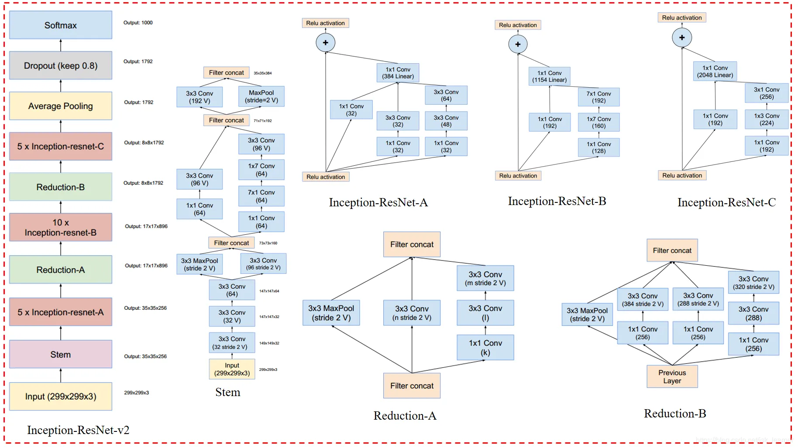
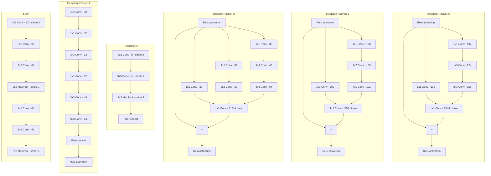
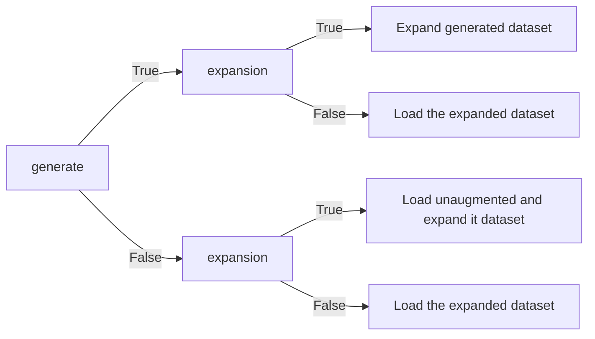

# Nonlinear Schrödinger Equation Parameter Estimation with Neural Networks

## Problem

### Physical situation

[NLSE](https://github.com/Quantum-Optics-LKB/NLSE) offers a powerful simulation tool to solve a typical [non linear Schrödinger](https://en.wikipedia.org/wiki/Nonlinear_Schr%C3%B6dinger_equation) / [Gross-Pitaevskii](https://en.wikipedia.org/wiki/Gross%E2%80%93Pitaevskii_equation) equation of the type :
$$i\partial_{t}\psi = -\frac{1}{2}\nabla^2\psi+g|\psi|^2\psi$$

In this particular instance, it can solve in the formalism of the propagation of a pulse of light in a non linear medium (here a Rubidium cell).
Within the [paraxial approximation](https://en.wikipedia.org/wiki/Paraxial_approximation), the propagation equation for the field $E$ in V/m solved is:

$$
i\partial_{z}E = -\frac{1}{2k_0}\nabla_{\perp}^2 E - n_2 \frac{k_0c\epsilon_0}{2}|E|^2E - i \frac{\alpha}{2}
$$

The system holds 2 unknowns: non-linear index $n_2$ and saturation intensity $I_{sat}$.
These parameters cannot be measured in the experiment. They are intrinsic properties of the system.

### Previous solution

The previous method to find these parameters was to fit the dephasing and the intensity with the solution of the following coupled differential equations.

$$
\frac{\partial_{}\phi}{\partial_{}z} = k_0 n_2 \frac{I}{1 + \frac{I}{I_{sat}}},  \\
\frac{\partial_{}I}{\partial_{}z} = - \alpha \frac{I}{1 + \frac{I}{I_{sat}}}
$$

The fit works well to extract n2 for large beams. However it fails to measure Isat. The problem is that even if the beam is large, the fit fails to include self-defocusing.

With the recent research in machine learning and optimization tools thriving, the idea was to attempt and solve this problem with neural networks. 

## Overview

This repository uses a Inception-Residual Network (Inception-Resnetv2) model dedicated to the estimation of parameters within the Nonlinear Schrödinger Equation (NLSE) representing the propagation of a laser beam inside a hot Rubidium vapor cell.

## Source

The code for this model is adapted from an unofficial PyTorch implementation of Inception-v4 and Inception-ResNet-v2, available at [this repository](https://github.com/zhulf0804/Inceptionv4_and_Inception-ResNetv2.PyTorch). This adaptation is inspired by the paper ["Inception-v4, Inception-ResNet and the Impact of Residual Connections on Learning" by Christian Szegedy, et al., 2016](https://doi.org/10.48550/arXiv.1602.07261).

# Inception-ResNet-v2 Model

```mermaid
graph LR
    A[Input - Batchx3x256x256] --> B[Stem]
    B -->|5 x| C[Inception-ResNet-A]
    C --> D[Reduction-A]
    D -->|10 x| E[Inception-ResNet-B]
    E --> F[Reduction-B]
    F -->|5 x| G[Inception-ResNet-C]
    G --> H[Average Pooling]
    H --> I[Dropout]
    I --> J[Softmax]
    J --> K[Output]
    K --> L[n_2]
    K --> M[I_sat]

    style A fill:#f9f,stroke:#333,stroke-width:4px
    style B fill:#bbf,stroke:#333,stroke-width:2px
    style C fill:#ccf,stroke:#333,stroke-width:2px
    style D fill:#ddf,stroke:#333,stroke-width:2px
    style E fill:#eef,stroke:#333,stroke-width:2px
    style F fill:#ffe,stroke:#333,stroke-width:2px
    style G fill:#ffe,stroke:#333,stroke-width:2px
    style H fill:#ffe,stroke:#333,stroke-width:2px
    style I fill:#ffe,stroke:#333,stroke-width:2px
    style J fill:#ffe,stroke:#333,stroke-width:2px
    style K fill:#ffe,stroke:#333,stroke-width:2px
    style L fill:#ffe,stroke:#333,stroke-width:2px
    style M fill:#ffe,stroke:#333,stroke-width:2px
```





## Workflow

1. **Create Your Setup**: Design your experimental or simulation setup.
2. **Record Output parameters**: Take note of all the parameters of the output camera that the dataset will need to represent.
3. **Generate Training Data**: The data is generated using [NLSE](https://github.com/Quantum-Optics-LKB/NLSE) based on your parameters.
4. **Train the Model**: Train the model using the generated data.
5. **Estimate your parameters**: Apply the trained model to new data to estimate parameters.

## Getting Started

### Prerequisites

Ensure you have Python 3.x installed. This project requires the following external libraries:

- **NumPy**
- **Matplotlib**
- **SciPy**
- **CuPy**
- **NLSE**
- **PyTorch**
- **Cupyx**
- **Skimage**
- **tqdm**
- **kornia**

These dependencies can be installed using mamba.

The requirements are in the requirements.txt at the root of the repo.

### Installation

Clone the repository and navigate into the project directory:

```bash
git clone https://github.com/Quantum-Optics-LKB/nlse_parameter_nn.git
cd nlse_parameter_nn
```

## Usage

The `parameters.py` script controls the data generation, training, and parameter estimation processes:

```bash
python parameters.py
```
### Parameters

#### <ins>Path and Device Settings<ins>
- `saving_path`: Directory where data and models will be saved.
- `device`: GPU device ID to run the code.

#### <ins>Data Generation and Augmentation<ins>
When you generate the data there are two steps.
First you generate using NLSE you propagate the beam with your parameters at the given parameters. Then your data is augmented. Meaning the program adds fringes at different angles, salt and pepper noise. 
This will help the model generalize the fitting of the parameters regardless of the noise.




- `generate`: Set to `True` to generate new data using NLSE.
- `expansion`: Set to `True` to augment an unaugmented dataset.

#### <ins>Data Generation Parameters<ins>
- `delta_z`: Step of the propagation in the split-step method (m).
- `resolution_input_beam`: Resolution of the input beam.
- `window_input`: Window size of the input beam (m).
- `output_camera_resolution`: Resolution of the output camera (in case not square give the smallest).
- `output_pixel_size`: Size of pixels of the output camera (m).
- `window_out`: Window size of the propagated output beam (m). It is set to be output_pixel_size x output_camera_resolution.
- `cell_length`: Length of the rubidium cell (m).
- `resolution_training`: Resolution of images when saved and for training.

#### <ins>Parameter Spaces<ins>
- `number_of_n2`: Number of different n2 values for training.
- `number_of_isat`: Number of different Isat values for training.
- `n2`: Range of n2 values (we use logspaces to ensure that that all parameters are represented).
- `isat`: Range of Isat values (we use logspaces to ensure that that all parameters are represented).

#### <ins>Laser Parameters<ins>
- `input_power`: Input power of the laser (W).
- `alpha`: Absorption parameter ($m^{-1}$) $I = I_0 \cdot e^{-\alpha \cdot L}$.
- `waist_input_beam`: Waist $\sigma$ (m) of the input gaussian beam $I_0 = e^{\frac{-(X^2 + Y^2)}{ \sigma^2} }$.
- `non_locality_length`: Length of non locality (m).

For for more information on the generation process see [NLSE](https://github.com/Quantum-Optics-LKB/NLSE) documentation.

#### <ins>Training Parameters<ins>
- `training`:  Boolean indicating whether to train the model.
- `learning_rate`: Learning rate for training.

The training is done is batches.
It means that when it does a forward path through the model it does not train the full dataset at the same time.
It is done for memory reasons (ie. you would not be able to load a big dataset on the GPU) but also because
training is better if the model receives samples by samples such that the parameters of the model get trained more times.
It improves the speed of the convergence.

- `batch_size`: Batch size for training.

The training method implements gradient accumulation.
It means that when you found the perfect batchsize but this many images don't fit on the GPU, you still can train at this batch size but the programs will devide the batch in the number you set to have the same training.
The accumulator variable is a multiplier that does that.

<ins>Example:<ins>

 You want total_batch_size = 99 but it is too big. What you can do is set batch_size = 33 and accumulator = 3. Therefore, only batchsize will be loaded on the GPU.

- `accumulator`: Gradient accumulation multiplier.
- `num_epochs`: Number of training epochs.

<ins>Note<ins>: 

- Since you need to accumulate, the training takes more time.
- To have no accumulation set `accumulator` to 1.

#### <ins>Experimental Data<ins>
- `exp_image_path`: Path to the experimental data. Experiment Data must be a complex array of shape (N, `output_camera_resolution`, `output_camera_resolution`) or (`output_camera_resolution`, `output_camera_resolution`).
- `use`: Boolean indicating whether to compute parameters for the dataset.
- `plot_generate_compare`: If True it will use the computed n2 and Isat generate using NLSE. You would be able to compare the result it to your estimate.