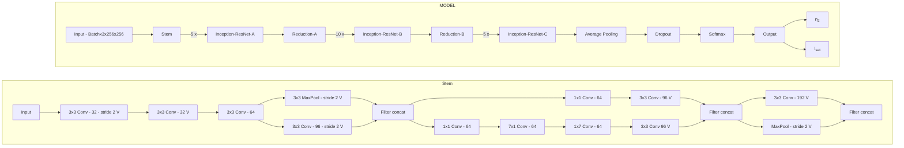
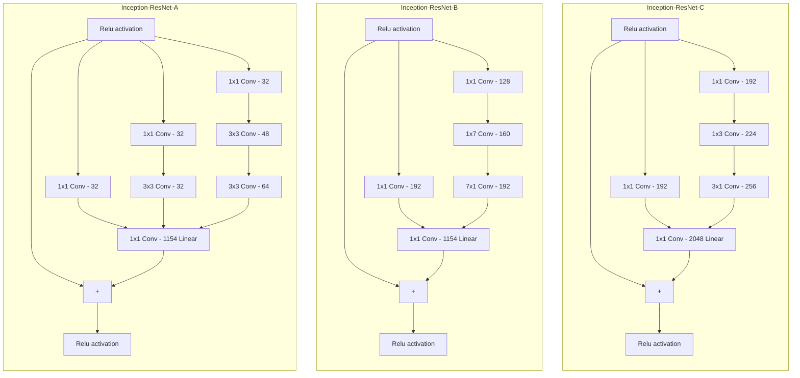
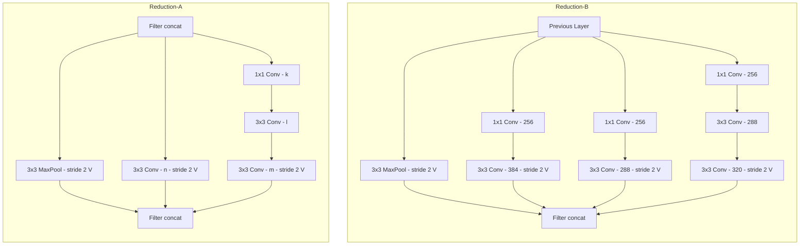
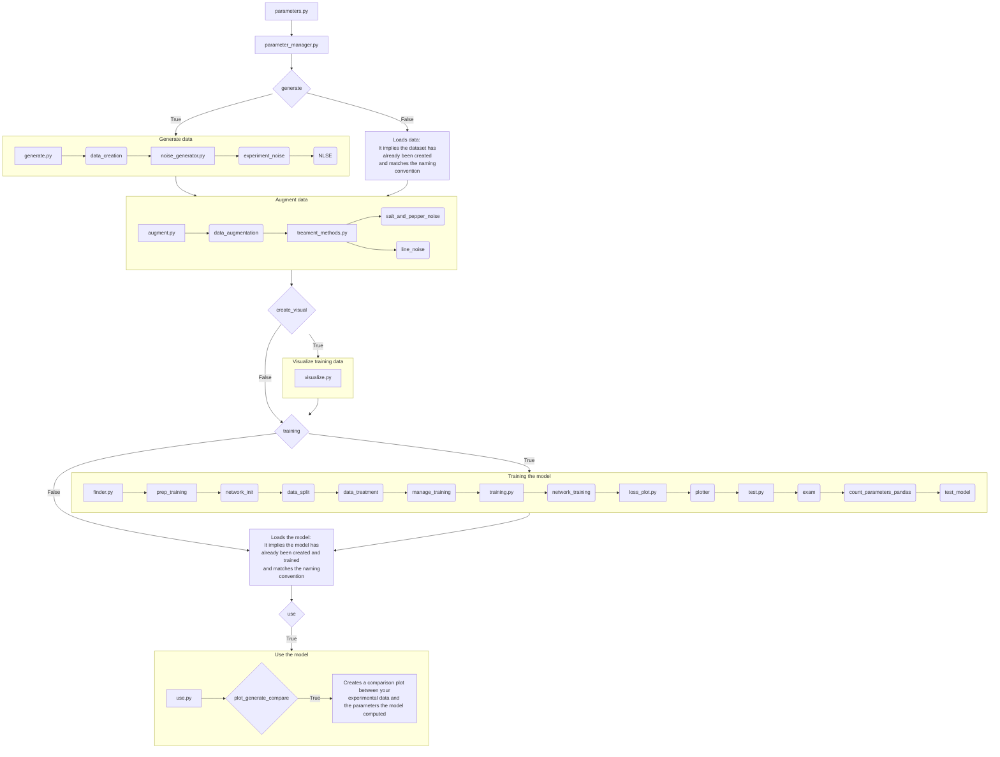

# Nonlinear Schrödinger Equation Parameter Estimation with Neural Networks

## Problem

### Physical situation

[NLSE](https://github.com/Quantum-Optics-LKB/NLSE) offers a powerful simulation tool to solve a typical [non linear Schrödinger](https://en.wikipedia.org/wiki/Nonlinear_Schr%C3%B6dinger_equation) / [Gross-Pitaevskii](https://en.wikipedia.org/wiki/Gross%E2%80%93Pitaevskii_equation) equation of the type :
$$i\partial_{t}\psi = -\frac{1}{2}\nabla^2\psi+g|\psi|^2\psi$$

In this particular instance, it can solve in the formalism of the propagation of a pulse of light in a non linear medium (here a Rubidium cell).
Within the [paraxial approximation](https://en.wikipedia.org/wiki/Paraxial_approximation), the propagation equation for the field $E$ in $V/m$ solved is:

$$
i\partial_{z}E = -\frac{1}{2k_0}\nabla_{\perp}^2 E - n_2 \frac{k_0c\epsilon_0}{2}|E|^2E - i \frac{\alpha}{2}
$$

The system holds 2 unknowns: non-linear index $n_2$ and saturation intensity $I_{sat}$.
These parameters cannot be measured in the experiment. They are intrinsic properties of the system.

With the recent research in machine learning and optimization tools thriving, the idea was to attempt and solve this problem with neural networks. 

## Overview

This repository uses the Inception-Residual Network (Inception-Resnetv2) model dedicated to the estimation of parameters within the Nonlinear Schrödinger Equation (NLSE) representing the propagation of a laser beam inside a hot Rubidium vapor cell.

## Source

The code for this model is adapted from an unofficial PyTorch implementation of Inception-v4 and Inception-ResNet-v2, available at [this repository](https://github.com/zhulf0804/Inceptionv4_and_Inception-ResNetv2.PyTorch). This adaptation is inspired by the paper ["Inception-v4, Inception-ResNet and the Impact of Residual Connections on Learning" by Christian Szegedy, et al., 2016](https://doi.org/10.48550/arXiv.1602.07261).

# Inception-ResNet-v2 Model




## Workflow

1. **Create Your Setup**: Design your experimental setup.
2. **Record Output parameters**: Take note of all the parameters of your system to ensure the data you will generate will be able to represent your system.
3. **Explore the parameter space**: There is a sandpox program that allows you to tryout your generation parameters to check that your simulations converge and looks a bit like your experiment.
4. **Generate Training Data**: The data is generated using [NLSE](https://github.com/Quantum-Optics-LKB/NLSE) based on your parameters.
5. **Train the Model**: Train the model using the generated data.
6. **Estimate your parameters**: Apply the trained model to new data to estimate parameters.

## Getting Started

### Prerequisites

Ensure you have Python 3.x installed. This project requires the following external libraries:

- **NumPy**
- **Matplotlib**
- **SciPy**
- **CuPy**
- **NLSE**
- **PyTorch**
- **Cupyx**
- **Skimage**
- **tqdm**
- **Kornia**

These dependencies can be installed using mamba.

The requirements are in the requirements.txt at the root of the repo.

### Installation

Clone the repository and navigate into the project directory:

```bash
git clone https://github.com/Quantum-Optics-LKB/nlse_parameter_nn.git
cd nlse_parameter_nn
```

## Usage

The `parameters.py` script is where you store the parameters for the data generation, training, and parameter estimation processes:

```bash
python parameters.py
```

The `sandbox_parameters.py` script is where you use the same parameters as for the data generation, training, and parameter estimation processes and see how the generated data would look like from your parameters. Then you can just take these parameters and put them into 
real `parameters.py` script.

```bash
python parameters.py
```
### Parameters

#### <ins>Path and Device Settings<ins>
- `saving_path`: Directory where data and models will be saved.
- `device`: GPU device ID to run the code.

#### <ins>Data Generation <ins>
When you generate the data there are two steps.
First you generate using NLSE you propagate the beam with your parameters at the given parameters. Then your data is augmented. Meaning the program adds fringes at different angles and salt and pepper noise. 
This will help the model generalize the fitting of the parameters regardless of the noise.

- `generate`: Set to `True` to generate new data using NLSE.

#### <ins>Data Generation Parameters using NLSE <ins>
##### Cell
- `alpha`: Absorption parameter ($m^{-1}$) $I = I_0 \cdot e^{-\alpha \cdot L}$.
- `non_locality_length`: Length of non locality ($m$).
- `cell_length`: Length of the rubidium cell ($m$).
##### Camera
- `resolution_input_beam`: Resolution of the input beam.
- `window_input`: Window size of the input beam ($m$).
- `output_camera_resolution`: Resolution of the output camera (in case not square give the smallest).
- `output_pixel_size`: Size of pixels of the output camera ($m$).
- `window_out`: Window size of the propagated output beam ($m$). It is set to be output_pixel_size x output_camera_resolution.
- `resolution_training`: Resolution of images when saved and for training.
##### Simulation
- `delta_z`: Step of the propagation in the split-step method ($m$).

#### <ins>Parameter Spaces<ins>
- `number_of_n2`: Number of different n2 values for training.
- `number_of_isat`: Number of different Isat values for training.
- `n2`: Range of n2 values (we use logspaces to ensure that that all parameters are represented).
- `isat`: Range of Isat values (we use logspaces to ensure that that all parameters are represented).

#### <ins>Laser Parameters<ins>
- `input_power`: Input power of the laser ($W$).
- `waist_input_beam`: Waist $\sigma$ ($m$) of the input gaussian beam $I_0 = e^{\frac{-(X^2 + Y^2)}{ \sigma^2} }$.

For for more information on the generation process see [NLSE](https://github.com/Quantum-Optics-LKB/NLSE) documentation.

#### <ins>Training Parameters<ins>
- `training`:  Boolean indicating whether to train the model.
- `learning_rate`: Learning rate for training.

The training is done in batches.
It means that when it does a forward pass (ie the model takes a training image through the model) through the model it does not train the full dataset at the same time.
It is done for memory reasons (ie. you would not be able to load a big dataset on the GPU) but also because training is better if the model receives samples by samples. It ensures the parameters of the model get trained more times.
It improves the speed of the convergence.

- `batch_size`: Batch size for training.

The training method implements gradient accumulation.
It means that when you found the perfect batchsize but this many images don't fit on the GPU, you still can train at this batch size but the programs will divide the batch in the number you set to have the same training.
The accumulator variable is a multiplier that does that.

<ins>Example:<ins>

 You want total_batch_size = 99 but it is too big. What you can do is set batch_size = 33 and accumulator = 3. Therefore, only batchsize will be loaded on the GPU.

- `accumulator`: Gradient accumulation multiplier.
- `num_epochs`: Number of training epochs.

<ins>Note<ins>: 

- Since you need to accumulate, the training takes more time.
- To have no accumulation set `accumulator` to 1.

#### <ins>Experimental Data<ins>
- `exp_image_path`: Path to the experimental data. Experiment Data must be a complex array of shape (`output_camera_resolution`, `output_camera_resolution`).
- `use`: Boolean indicating whether to compute parameters for the dataset.
- `plot_generate_compare`: If True it will use the computed n2 and Isat generate using NLSE. You would be able to compare the result it to your estimate.

## Example Usage

The `parameters.py` contains this code.
You can just choose your parameters and launch the code.
```python
#!/usr/bin/env python3
# -*- coding: utf-8 -*-
# @author: Louis Rossignol

import numpy as np
from engine.parameter_manager import manager
saving_path="/your/saving/path"
device = 0

###Data generation Parameters:
delta_z=1e-4 #m
resolution_input_beam = 2048
window_input = 50e-3 #m
output_camera_resolution = 3008
output_pixel_size = 3.76e-6 #m
window_out = output_pixel_size * output_camera_resolution #m
cell_length=20e-2 #m
resolution_training = 256
generate = True
create_visual = False

###Parameter spaces:
number_of_n2 = 20
number_of_isat = 20
n2 = -5*np.logspace(-10, -9, number_of_n2) #m/W^2 [-5e-10 -> -5e-9]
isat = np.logspace(4, 5, number_of_isat) #W/m^2 [1e4 -> 1e5]

###Laser Parameters:
input_power = 1.05 #W
alpha = 22 #m^-1
waist_input_beam = 2.3e-3 #m
non_locality_length = 0 #m

###Training Parameters:
training=True
learning_rate=0.01
batch_size=100
accumulator=1
num_epochs=100

###Find your parameters (n2 and Isat):
exp_image_path="/your/experiment/path/experiment.npy"
use=True
plot_generate_compare=True

manager(generate, training, create_visual, use, plot_generate_compare, device, 
            resolution_input_beam, window_input, window_out, resolution_training, n2, number_of_n2,
            input_power, alpha, isat, number_of_isat, waist_input_beam, non_locality_length, delta_z, cell_length, 
            saving_path, exp_image_path, learning_rate, batch_size, num_epochs, accumulator)
```
The `sandbox_parameters.py` contains this code.
You can just choose your parameters and launch the code.

```python
#!/usr/bin/env python3
# -*- coding: utf-8 -*-
# @author: Louis Rossignol

from engine.nlse_sandbox import sandbox

saving_path="/your/saving/path"
device = 0

###Data generation Parameters:
delta_z=1e-4 #m
resolution_input_beam = 2048
window_input = 50e-3 #m
output_camera_resolution = 3008
output_pixel_size = 3.76e-6 #m
window_out = output_pixel_size * output_camera_resolution #m
cell_length=20e-2 #m
resolution_training = 256

###Parameter spaces:
number_of_n2 = 1
number_of_isat = 1
n2 = -5e-9 #m/W^2 #switch this to an actual range using numpy to launch the real simulation 
isat = 1e5 #W/m^2 #switch this to an actual range using numpy to launch the real simulation

###Laser Parameters:
input_power = 1.05 #W
alpha = 22 #m^-1
waist_input_beam = 2.3e-3 #m
non_locality_length = 0 #m

###Find your parameters (n2 and Isat):
exp_image_path="/your/experiment/path/experiment.npy"

sandbox(device, resolution_input_beam, window_input, window_out,
        resolution_training, n2, input_power, alpha,
        isat, waist_input_beam, non_locality_length, delta_z,
        cell_length, exp_image_path, saving_path)
```
## Program flowchart

