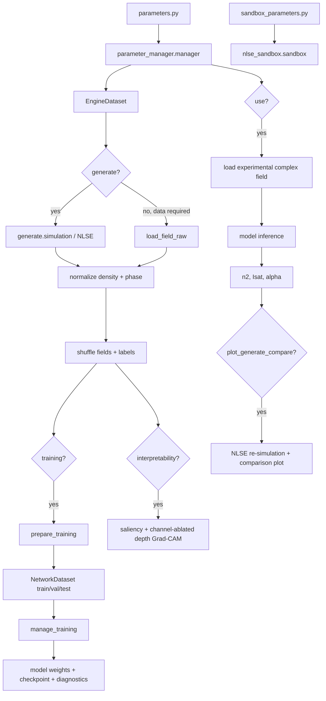

# XP2NLSE-ML

**Machine-learning estimation of nonlinear Schrödinger equation parameters from a single complex optical field.**

[](https://arxiv.org/abs/2509.18479)

XP2NLSE-ML combines GPU-accelerated nonlinear Schrödinger equation (NLSE) simulations with a modified ConvNeXt-Tiny network to estimate three physical parameters of a nonlinear optical medium:

- nonlinear refractive index `n2`
- saturation intensity `Isat`
- absorption coefficient `alpha`

The model takes two image channels derived from a complex optical field: normalized density and normalized phase.

> The repository has evolved significantly since the original README. The documentation below reflects the current code on `main` as of September 2026. See [Known implementation caveats](#known-implementation-caveats) before launching a new training run.

## Citation

If you use this work, please cite:

```bibtex
@misc{rossignol2025machinelearningapproachsingleshot,
  title={Machine learning approach to single-shot multiparameter estimation for the non-linear Schr\"odinger equation},
  author={Louis Rossignol and Tangui Aladjidi and Myrann Baker-Rasooli and Quentin Glorieux},
  year={2025},
  eprint={2509.18479},
  archivePrefix={arXiv},
  primaryClass={quant-ph},
  url={https://arxiv.org/abs/2509.18479}
}
```

## What the repository does

The end-to-end workflow is:

1. choose a physically meaningful parameter domain;
2. validate representative parameters with `sandbox_parameters.py`;
3. generate a synthetic grid of NLSE simulations;
4. convert each simulated complex field into density and phase channels;
5. normalize and shuffle the dataset;
6. train a two-channel ConvNeXt-based regressor;
7. evaluate predictions on a held-out test split;
8. optionally compute saliency and depth-wise Grad-CAM maps;
9. apply a trained model to an experimental complex field;
10. optionally re-simulate the inferred parameters for a visual experiment/simulation comparison.

The main orchestration entry point is `engine.parameter_manager.manager`.

## Repository layout

```text
xp2nlse-ml/
├── README.md
├── requirements.txt
├── parameters.py
├── sandbox_parameters.py
├── docs/
│   ├── ARCHITECTURE.md
│   └── USAGE.md
└── engine/
    ├── engine_dataset.py
    ├── generate.py
    ├── interpretability.py
    ├── model.py
    ├── network_dataset.py
    ├── nlse_sandbox.py
    ├── parameter_manager.py
    ├── test.py
    ├── training.py
    ├── training_manager.py
    ├── use.py
    └── utils.py
```

For a module-by-module explanation, see [docs/ARCHITECTURE.md](docs/ARCHITECTURE.md). For commands, parameters, file formats, and workflows, see [docs/USAGE.md](docs/USAGE.md).

## Installation

The project is GPU-oriented. NLSE generation uses CuPy, and training is designed for PyTorch on an accelerator.

```bash
git clone https://github.com/Quantum-Optics-LKB/xp2nlse-ml.git
cd xp2nlse-ml

python -m venv .venv
source .venv/bin/activate
python -m pip install --upgrade pip
pip install -r requirements.txt
```

The current dependency list includes CuPy for CUDA 12, PyTorch, Torchvision, Kornia, NumPy/SciPy, scikit-image, scikit-learn, Matplotlib, tqdm, and the `NLSE` package.

On HPC systems, use the CUDA/Python environment that matches the installed CuPy and PyTorch builds.

## Quick start

### 1. Check the physical parameter regime

Edit `sandbox_parameters.py` and provide a complex experimental field stored as a NumPy `.npy` array.

```bash
python sandbox_parameters.py
```

The sandbox performs a single NLSE simulation and saves a comparison plot to:

```text
<saving_path>/sandbox.png
```

Use this step to verify simulation resolution, simulation window, training window, cell length, beam waist, and representative `n2`, `Isat`, and `alpha` values.

### 2. Configure the full pipeline

`parameters.py` defines the parameter grid and calls `manager(...)`.

Important groups are:

- simulation geometry: `resolution_simulation`, `window_simulation`, `window_training`, `length`
- parameter grid: `n2_values`, `isat_values`, `alpha_values`
- beam: `input_power`, `waist`
- numerical controls: `delta_z`, `non_locality`, `device_number`, `resolution_training`
- training: `learning_rate`, `batch_size`, `accumulator`, `num_epochs`
- pipeline switches: `generate`, `training`, `create_visual`, `use`, `plot_generate_compare`
- interpretability: `interpretability`, `interp_methods`, `interp_num_samples`, `interp_output_subdir`, `interp_overlay_alpha`, `interp_dpi`

Run:

```bash
python parameters.py
```

See [docs/USAGE.md](docs/USAGE.md) for a complete, explicit `manager(...)` example.

## Simulation dataset

`EngineDataset` builds the Cartesian product of all `alpha`, `n2`, and `Isat` values.

The generated field has shape:

```text
(N_alpha * N_n2 * N_Isat, 2, resolution_training, resolution_training)
```

with `float32` storage.

Channels:

- channel 0: optical density/intensity, computed as `|A|^2 c epsilon_0 / 2`
- channel 1: optical phase, computed with `angle(A)`

The current generator creates a Gaussian input beam, propagates it with the external `NLSE` package, crops the simulated window, and resamples to the training resolution.

**Generation-time noise is not currently applied**, despite older documentation and an unused `experiment_noise` helper remaining in the repository.

### Dataset files

Generation currently writes both:

```text
Es_w<resolution>_n2<Nn2>_isat<NIsat>_alpha<Nalpha>_power<P>.npz
```

and a raw-array representation:

```text
Es_w<resolution>_n2<Nn2>_isat<NIsat>_alpha<Nalpha>_power<P>.raw
Es_w<resolution>_n2<Nn2>_isat<NIsat>_alpha<Nalpha>_power<P>.json
```

The `.json` file stores dtype, shape, and memory order. The current reload path in `parameter_manager.py` uses the `.raw + .json` representation.

## Preprocessing

Before training:

1. each density image is shifted by its own minimum;
2. each density image is divided by its own maximum;
3. phase is mapped from `[-pi, pi]` to `[0, 1]`;
4. fields and labels are shuffled together;
5. each target parameter is min-max normalized to `[0, 1]`;
6. data are split 80% / 10% / 10% into train / validation / test sets.

The min/max values used for target de-normalization are written to `standardize.txt`.

## Model

The network is defined in `engine/model.py`.

### Backbone

A Torchvision `convnext_tiny(weights=None)` model is modified to:

- accept 2 input channels instead of RGB;
- remove the classification head;
- expose the 768-dimensional ConvNeXt representation.

### Regression heads

The 768-dimensional representation passes through shared fully connected layers:

```text
768 -> 2048 -> 1024 -> 512
```

with BatchNorm, ReLU, and dropout.

From the shared 512-dimensional representation:

- `Isat` is predicted by an independent sigmoid head;
- `alpha` is predicted by an independent sigmoid head;
- `n2` is predicted conditionally using the shared features plus learned embeddings of the predicted `Isat` and `alpha`;
- a six-value covariance head parameterizes uncertainty/correlation information for the three outputs.

## Loss and optimization

The current `MultivariateNLLLoss` builds a lower-triangular Cholesky factor from six predicted covariance parameters and evaluates a multivariate Gaussian negative log-likelihood using triangular solves.

The current implementation additionally applies a strong Smooth-L1 penalty to the normalized `n2` prediction:

```text
loss = multivariate_NLL + 5000 * smooth_L1(n2_pred, n2_true)
```

Training is configured around:

- AdamW;
- weight decay `1e-5`;
- `ReduceLROnPlateau`;
- gradient clipping;
- gradient accumulation;
- validation MAE and R² reporting;
- best-validation checkpointing;
- early stopping logic.

See the caveat below: the present `network_training()` contains a debug `break` that currently prevents the intended training loop from executing.

## Training artifacts

Training outputs are written under:

```text
<saving_path>/training_n2<Nn2>_isat<NIsat>_alpha<Nalpha>_power<P>/
```

The code is designed to produce:

- `n2_net_w...pth` — model state dictionary
- `checkpoint.pth.tar` — resumable best-validation checkpoint
- `params.txt` — physical and training configuration
- `standardize.txt` — target min/max values
- `testing.txt` — training/test diagnostics
- `losses_w...png` — loss curve
- `losses_w...csv` — numeric loss history
- `predictedvstrue_n2.png`
- `predictedvstrue_isat.png`
- `predictedvstrue_alpha.png`
- `predictions.csv` — normalized expected/predicted test values

Model-weight binaries are not intended to be committed to GitHub. Keep generated datasets and trained weights as external experiment artifacts.

## Interpretability

`engine/interpretability.py` implements two dataset-driven interpretation methods:

### Saliency

For selected samples, gradients of each output with respect to both input channels are computed:

- `|d y_n2 / d density|`
- `|d y_n2 / d phase|`
- `|d y_Isat / d density|`
- `|d y_Isat / d phase|`
- `|d y_alpha / d density|`
- `|d y_alpha / d phase|`

The effective implementation also reports raw channel saliency statistics and phase/density ratios.

### Depth Grad-CAM

Grad-CAM is evaluated at the first, middle, and last Conv2d layers. The effective implementation uses channel ablation:

- density CAM: phase channel zeroed;
- phase CAM: density channel zeroed.

Samples are selected approximately uniformly across normalized `(n2, Isat, alpha)` label space.

Interpretability requires an already-trained matching `.pth` model and an already-loaded simulation dataset.

See [docs/USAGE.md](docs/USAGE.md) for configuration.

## Experimental inference

`engine/use.py` loads a complex experimental `.npy` field, resizes it to `resolution_training`, constructs normalized density and phase channels, loads `standardize.txt` plus the trained `.pth` weights, and returns physical `n2`, `Isat`, and `alpha` values.

If `plot_generate_compare=True`, the inferred parameters are fed back into the NLSE simulator and a comparison image is written under `saving_path`.

## Known implementation caveats

The September 2026 code contains several issues worth fixing before relying on a fresh end-to-end run:

1. **Training loop debug break** — `engine/training.py::network_training` has an unconditional `break` at the beginning of the epoch loop, so the intended optimizer loop is currently skipped.
2. **Interpretability module duplicated** — `engine/interpretability.py` contains two complete implementations in the same file. Python uses the later definitions; the earlier implementation is effectively shadowed.
3. **Interpretability defaults in `manager`** — several defaults are Python type objects (`bool`, `list`, `int`, etc.) rather than usable default values. Pass all interpretability arguments explicitly.
4. **Test-path trailing call** — `engine/test.py::test_model` makes an additional call to `save_predictions_to_csv(true_values, predictions, path)` using undefined names after `plot_prediction`. The plotting utility already saves `predictions.csv`.
5. **Dataset is written twice** — generation currently saves both `.npz` and `.raw/.json`, while the manager reloads only the raw representation.
6. **Interpretability output extension** — the current code constructs a PNG path and then immediately replaces it with an SVG path, so the effective per-sample interpretability output is SVG.
7. **Old noise description** — `experiment_noise` still exists in `utils.py`, but `generate.py` no longer applies it to the Gaussian beam.

These are implementation issues rather than conceptual requirements of the method. They are documented so that results are reproducible against the actual repository state.

## Program flow


```mermaid
flowchart TD
    A[parameters.py] --> B[parameter_manager.manager]
    S[sandbox_parameters.py] --> SB[nlse_sandbox.sandbox]

    B --> C[EngineDataset]
    C --> D{generate?}
    D -->|yes| E[generate.simulation / NLSE]
    D -->|no, data required| F[load_field_raw]

    E --> G[normalize density + phase]
    F --> G
    G --> H[shuffle fields + labels]

    H --> I{training?}
    I -->|yes| J[prepare_training]
    J --> K[NetworkDataset train/val/test]
    K --> L[manage_training]
    L --> M[model weights + checkpoint + diagnostics]

    H --> N{interpretability?}
    N -->|yes| O[saliency + channel-ablated depth Grad-CAM]

    B --> P{use?}
    P -->|yes| Q[load experimental complex field]
    Q --> R[model inference]
    R --> T[n2, Isat, alpha]
    T --> U{plot_generate_compare?}
    U -->|yes| V[NLSE re-simulation + comparison plot]
```

## Further documentation

- [Architecture and implementation](docs/ARCHITECTURE.md)
- [Usage, parameters, files, and workflows](docs/USAGE.md)
- [NLSE simulator](https://github.com/Quantum-Optics-LKB/NLSE)
- [ConvNeXt](https://arxiv.org/abs/2201.03545)
- [Project preprint](https://arxiv.org/abs/2509.18479)

## Future directions

Natural extensions include additional NLSE/CNLSE propagators, additional inferred physical parameters, transfer learning/pretraining, more explicit uncertainty calibration, and a cleaner experiment-artifact/versioning workflow.
